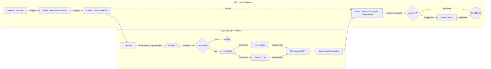
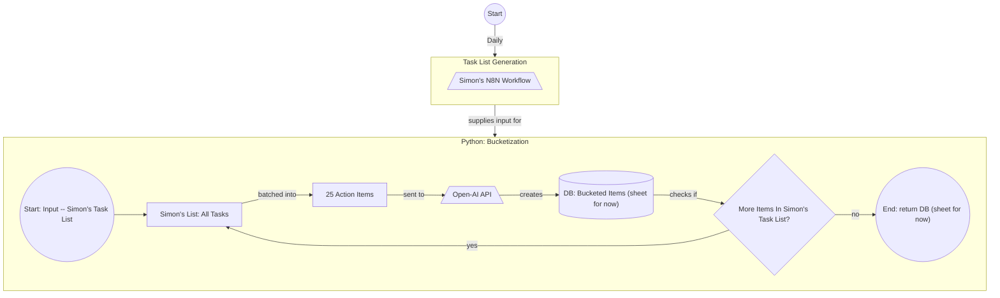

# automated-follow-ups

## High Level Flow

```mermaid
flowchart LR
    subgraph hl[High Level Overview]
        hlA[Meeting Complete]
        hlB[Apollo Generates Transcript]
        hlC[Python or N8N Workflow]
        hlD[Email Draft Containing Pre-Created Media]
        hlE{Approved?}
        hlF[Rewrite Email]
        hlG@{shape: circle, label: Send Email}

        hlA -- triggers --> 
        hlB -- triggers -->
        hlC -- creates --> hlD
        hlD -- executive assistant --> hlE
        hlE -- approved --> hlG
        hlE -- disapproved --> hlF
        hlF -- approved --> hlG
    end

    subgraph wf[Python or N8N Workflow]
        wfA[Transcript]
        wfB@{shape: trapezoid, label: AI-Agent 1}
        wfC{Next Steps?}
        wfE[Action Type]
        wfF@{shape: circle, label: Stop}
        wfH@{shape: trapezoid, label: AI-Agent 2}
        wfI[Person Type]
        wfJ["DB (sheets, RDS?)"]
        wfZ[Email Draft Completed]
        
        wfA -- automatically ingested into --> wfB
        wfB -- decides if --> wfC
        wfC -- no --> wfF
        wfC -- yes --> wfH
        wfH -- determines --> wfE
        wfH -- determines --> wfI
        wfE -- ingested into --> wfJ
        wfI -- ingested into --> wfJ
        wfJ --> wfZ
        
        %% need to determine how the media is retrieved and sent to the sheet
        wfZ --> hlD
    end

    hlC --> wfA
```

## Bucketization

```mermaid
flowchart
	A@{ shape: circle, label: "Start"}
	subgraph pre[Task List Generation]
		pA@{ shape: trapezoid, label: Simon's N8N Workflow}
	end
	subgraph bkt[Python: Bucketization]
		bStart@{ shape: circle, label: "Start: Input -- Simon's Task List" } -->
		bA[Simon's List: All Tasks] -- batched into -->
		bB[25 Action Items] -- sent to -->
		bC@{ shape: trapezoid, label: Open-AI API} -- creates -->
		bE@{ shape: database, label: "DB: Bucketed Items (sheet for now)"} -- checks if -->
		bF@{ shape: diamond, label: More Items In Simon's Task List?}
		bF -- yes --> bA
		bF -- no --> 
		bEnd@{ shape: circle, label: "End: return DB (sheet for now)" }
	end

	
	A -- Daily --> 
	pre -- supplies input for --> 
	bkt
```